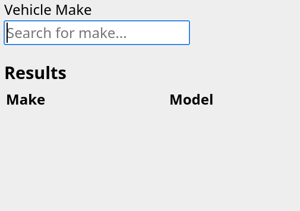

# Vehicle Search

A vehicle search tool

## Learning Objectives

After completing this lab, students will be able to:

1. Attach event listeners to DOM elements
2. Get JSON data using `fectch()`
3. Use `async` and `await` to manage Promises

## Task

Handout code is provided in [index.html](index.html).

1. Use the [API](https://vpic.nhtsa.dot.gov/api) provide by the [NHTSA](https://www.nhtsa.gov/) to fetch a JSON array of vehicles that match a supplied make.
2. Place the vehicles provided in the array into the `tbody` provided in the results `table`.

## Resources

- [MDN: Fetch](https://developer.mozilla.org/en-US/docs/Web/API/Fetch_API)
- [MDN: Events](https://developer.mozilla.org/en-US/docs/Web/API/Document_Object_Model/Events)
